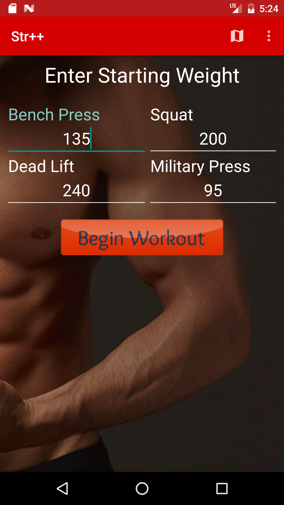
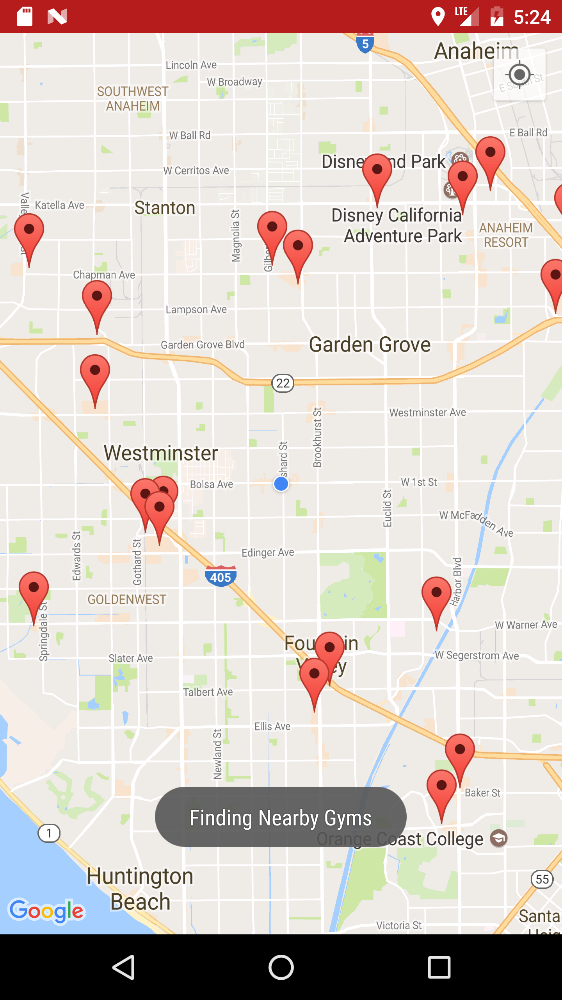
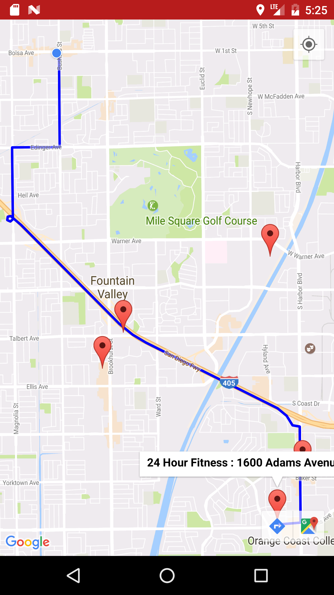
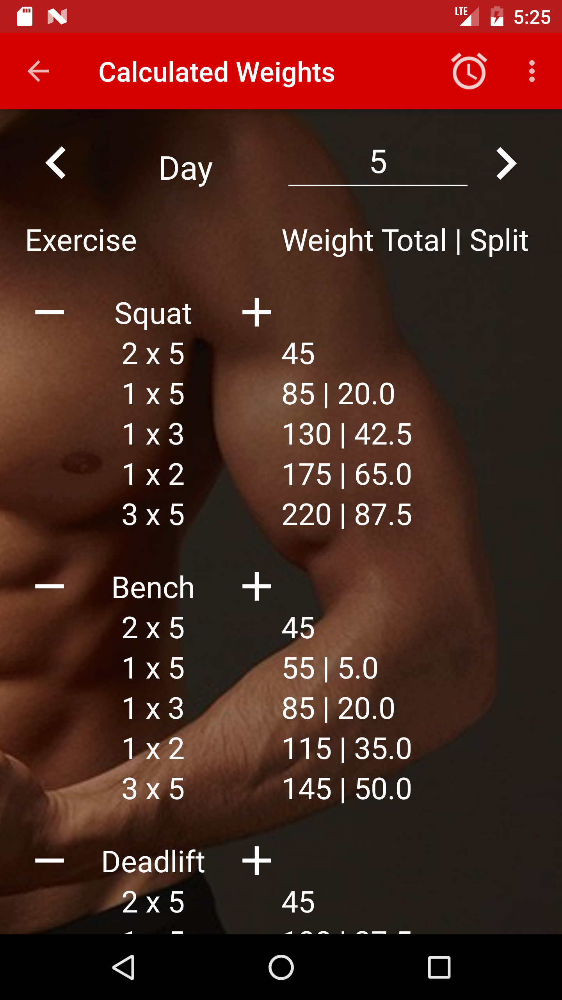
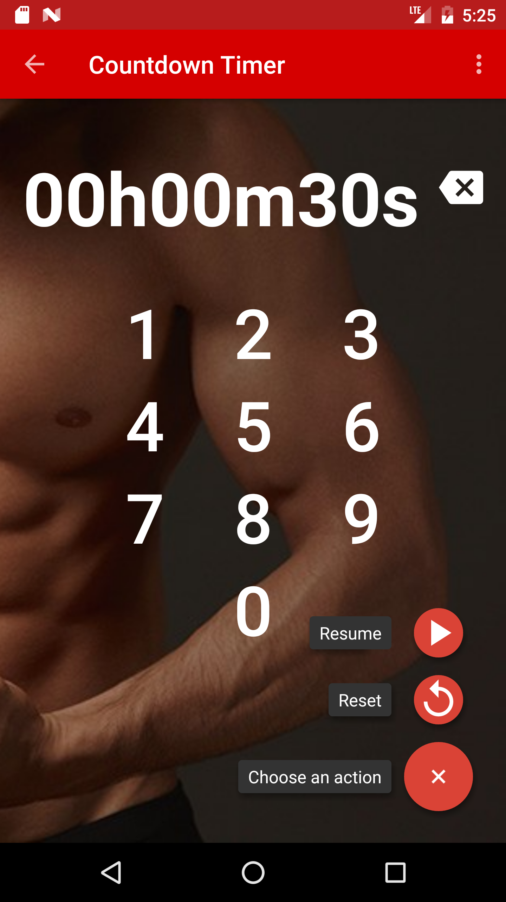
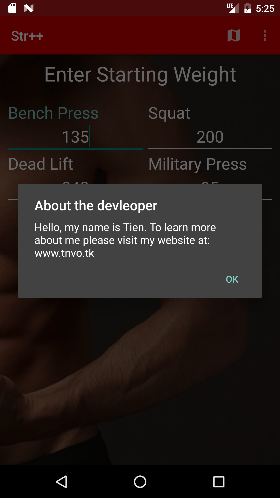

# Str++
Android fitness app based on "Starting Strength".

# Requirements
Best used with Android **API Level 23+**.

# Features
- Find nearby gyms and get directions in Google Maps
- Keep track of your strength and weight as you progress
- Countdown timer and alarm

# Screenshots
  
  

# Changelog
Check out the [Releases](https://github.com/Tempest-Blue/Str/releases) page for recent changes.

# Credits
Based on the Starting Strength program by Mark Rippetoe.
